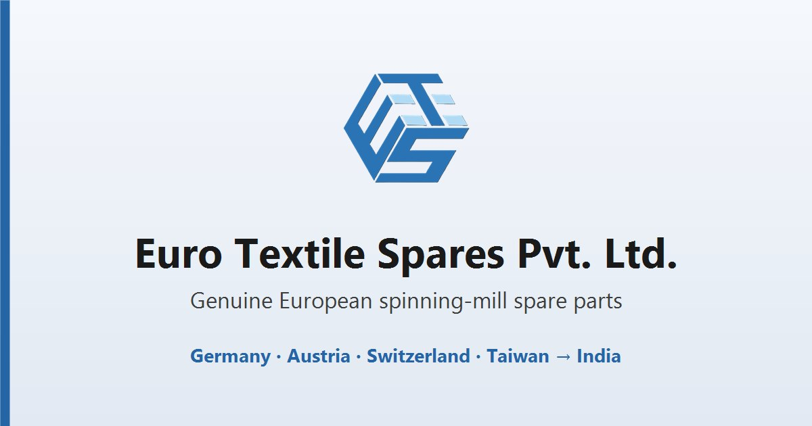

# Euro Textile Spares — website

Marketing and catalogue site for **Euro Textile Spares Pvt. Ltd.**, a Pune-based importer and
distributor of genuine European and Taiwanese textile-machinery spare parts for India's spinning
mills.

It is a single page. In order: hero, a clients marquee, about, a manufacturers grid, a product
catalogue split into six categories (Complete Rotors, Autocoro, Autoconer, Ring Frame, Navels, Twin
Discs), capabilities, and a contact form. The catalogue grids, spec tables and their live search are
rendered from `data.js` at page load.

## Stack

- Plain HTML, CSS and JavaScript. **No framework, no build step, no `package.json`, no npm install.**
- GSAP is vendored into `js/vendor/`, not loaded from a CDN, so the animation works offline.
- The only external request is the Manrope webfont from Google Fonts.

## Running it

Open `index.html` in a browser. That's it — there is nothing to install, compile or bundle.

To exercise it over `http://` instead of `file://`, serve the folder with any static file server:

```sh
npx serve .                    # Node
python -m http.server 8000     # or Python, then open http://localhost:8000
```

## Cloning

The working tree is about 24 MB, but **`git clone` pulls roughly 311 MB.** The original
camera-resolution photo folders were removed from tracking and added to `.gitignore`, but they are
still present in the history, which has not been rewritten. For a working copy, take a shallow one:

```sh
git clone --depth 1 https://github.com/Siddengle23/EuroTextile-website-.git
```

## What's in here

| Path | What it is |
| --- | --- |
| `index.html` | All page markup, plus the SEO meta block and the JSON-LD `Organization` data |
| `style.css` | All styling. Design tokens (colours, radii, shadows) are custom properties in `:root` |
| `script.js` | All behaviour, in one IIFE: tabs, search, lightbox, nav, contact form, GSAP motion |
| `data.js` | Catalogue data as plain global arrays, loaded *before* `script.js` |
| `js/vendor/` | `gsap.min.js` and `ScrollTrigger.min.js` |
| `images/` | Served assets — `parts/`, `machines/`, `manufacturers/`, `clients/`, logos, social preview |
| `catalogues/` | Manufacturer PDF catalogues; three are linked from the product panels |
| `robots.txt`, `sitemap.xml` | SEO files |
| `CLAUDE.md` | Detailed engineering notes — architecture, conventions and the reasoning behind them |

## Making changes

- Catalogue entries live in `data.js` as plain global `const` arrays; product photos go in
  `images/parts/`.
- Everything else — copy, sections, navigation — is in `index.html`.
- **The visible copy follows a documented voice**, and the product facts in it (rotor types,
  coatings, Ø ranges, speeds, machine compatibility) are load-bearing. Reword with care and check
  `CLAUDE.md` first; the spellings, the punctuation rules and the claims that must not widen are all
  written down there.
- **Read `CLAUDE.md` before editing.** It documents constraints that are not visible in the code,
  and several of them fail silently rather than throwing an error: category links must stay in sync
  across four places, every client logo appears twice in the markup, and a handful of CSS rules that
  look like dead weight are load-bearing.

## Before deploying

- The absolute URLs in the `<head>` (canonical, Open Graph, Twitter), in `robots.txt` and in
  `sitemap.xml` point at `https://eurotextilespares.in/` — the bare apex, matching `CNAME` and the
  Custom domain set in the repo's GitHub Pages settings. **Don't add `www.`**: that host resolves
  only as a redirect to the apex, so a `www.` canonical or `og:image` points at a 301. Update them
  if the host ever changes — `og:url` and `og:image` must stay absolute or link previews break. Note
  the contact email stays on the `.com` domain, so the two differ by design; never bulk-replace the
  domain, as the contact form's endpoint is built from that email address.
- `sitemap.xml`'s `<lastmod>` goes stale on any material content change; bump it before deploying.
- After a deploy that changes `og:image`, re-scrape the preview in LinkedIn's Post Inspector and
  Facebook's Sharing Debugger — both cache the card per URL.
- The contact form posts to **formsubmit.co**, which requires a one-time email activation. Until
  that is completed the endpoint can still return OK, so the visitor sees a success message while no
  mail arrives. Send a real test submission after the first deploy.

## Usage & rights

The site, its copy and its product photography are proprietary to Euro Textile Spares Pvt. Ltd. and
are not offered for reuse.

The manufacturer catalogues in `catalogues/`, the manufacturer marks in `images/manufacturers/` and
the client logos in `images/clients/` remain the property of their respective owners and appear here
in the course of Euro Textile Spares' distribution business. There is deliberately no open-source
licence file: one would purport to grant rights over material that is not the company's to license.
